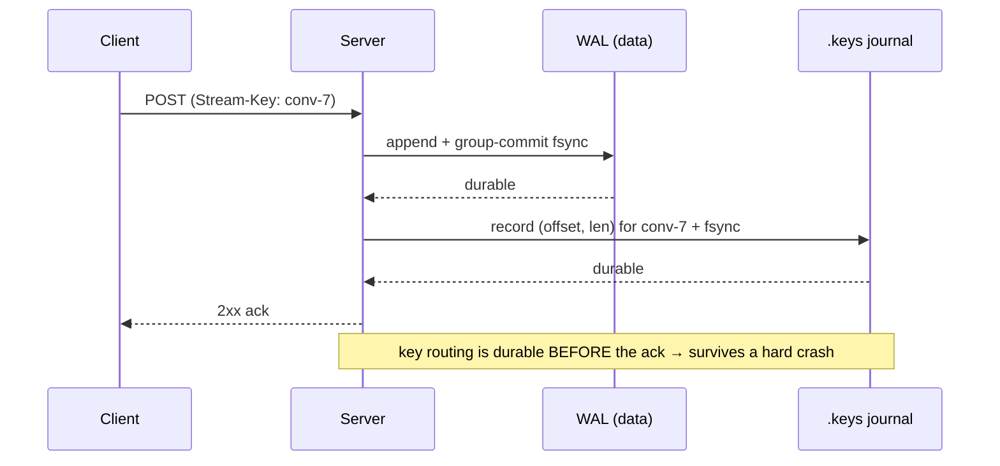
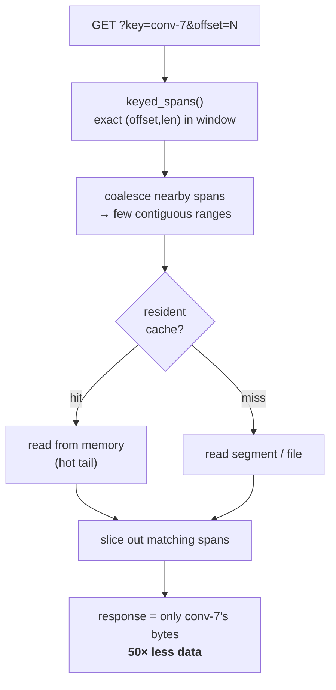

# rheoDS

> **Keyed-by-conversation reads for the Rust Durable Streams server.**
> Read one conversation out of a multiplexed stream — fast, durable, live.

One stream per namespace, `Stream-Key: <key>` on write, `?key=<key>` on read — `<key>`
can be anything (a conversation id, a session, a document, whatever your app scopes
by). That's the [Prisma Bun server's](https://github.com/prisma/streams) model —
now on the [`durable-streams`](https://crates.io/crates/durable-streams) Rust
server, which had **no keyed reads at all** before this.

## Why

| Capability | This (Rust) | Prisma (Bun) |
|---|:---:|:---:|
| Native, zero-copy I/O | ✓ | ✗ |
| Fork / branching | ✓ | ✗ |
| Keyed-by-conversation reads | ✓ *(new)* | ✓ |

The Rust server was the fastest known Durable Streams implementation but couldn't
filter by key; Bun could filter but isn't native and can't fork. Keyed reads are
what this project adds, so the Rust server keeps its speed and fork advantage.
Delivered as source patches over pristine `durable-streams-0.1.2`.

## Benchmarks

Both servers in **one Linux container, same kernel**, same `oha` harness
(N=2000, K=50, ~200 B, 6 s × 3).

| scenario | This (Rust) | Bun | Rust |
|---|--:|--:|:--:|
| keyed read `?key=` (one conversation) | **41,113 rps** · 1.3 ms | 5,787 rps · 9.9 ms | **~7×** |
| full read | **18,000 rps** · 3.4 ms | 803 rps · 77 ms | **~22×** |
| keyed CPU / request | 0.007 | 0.017 | ~2.4× leaner |

## Features

- **`Stream-Key` on append + `?key=` filtered reads** — isolate one conversation; composes with `?offset=`.
- **`Stream-Key` on fork-create** (whole-stream fork) — set the key in the same request as the fork trio (`Stream-Forked-From` = a stream **path**, `-Fork-Offset` / `-Fork-Sub-Offset`); the new branch stream is `?key=`-routable at birth (its inherited byte prefix resolves through the fork chain) and later keyed appends route to it — no separate priming append needed.
- **In-stream keyed fork** (fork one conversation out of a multiplexed stream) — when `Stream-Forked-From` names a **source KEY** within an already-existing target stream and `Stream-Key` names the new branch key, the branch inherits the source key's rows **strictly before the cut** — `Stream-Fork-Sub-Offset` is the cut, expressed as the source key's span index (count of its appends to inherit; omitted = all). No new stream, no `Stream-Fork-Offset` (the inherited rows already live in this stream); other keys interleaved in the same stream never leak in, and keyed appends under the branch key extend it. This is the shape a one-stream-per-namespace app (`Stream-Key` = conversation) needs to fork/edit a single conversation — a whole-stream fork would inherit every conversation's bytes and can't isolate one by key.
- **Fast** — coalesced spans + resident-cache-first serving (see [Benchmarks](#benchmarks)).
- **Durable at ack** — a per-stream `.keys` journal fsyncs before the append is acked; rebuilt on restart. No crash-tail window.
- **Live** — keyed long-poll + SSE; a reader advances past other keys' data.
- **Real-client verified** — `@durable-streams/state`'s `createStreamDB` folds a `?key=` read into just that conversation's rows.
- **103 tests** (87 upstream + keying / fork-keying / in-stream keyed fork / persistence / live / journal); patch set verified to apply clean and compile.

## How it works

**Writes are durable *before* the ack** — the routing key lives only in a request
header, so it's journaled and fsync'd alongside the data's own durability:



**Reads filter server-side, cheaply** — the exact per-append directory gives byte
ranges directly (no probabilistic index needed); scattered spans are coalesced
into few contiguous reads, served resident-cache-first, sliced in memory:



On restart, the `.keys` journal is replayed (torn-tail-safe, like the WAL) to
rebuild the in-memory directory — so keyed reads survive a crash unchanged.

## Limitations

- **Keyed-read CPU** — on Linux, keyed reads are CPU-competitive with a full read and *leaner per request than Bun* (the ~1,180% CPU seen on macOS was a zero-copy-disabled fallback artifact, not a real property).
- **Per-append fsync** on keyed writes (WAL + journal) buys durable-at-ack; batching into the WAL group commit would amortize it — a future perf optimization, not a correctness need.
- **Linux zero-copy guard** (`#[cfg(target_os = "linux")]`) is hand-reviewed but not compiled on macOS — needs a Linux/CI build.
- **`crates/ds-index`** (Prisma-style fuse-filter segment index) is tested but deliberately **not wired in** — the exact in-memory directory makes it unnecessary until a stream outgrows memory or spans thousands of cold segments. At that extreme, Bun's segment index likely beats the coalesce-and-filter approach until this is wired.

## Layout

```
patches/            generated diffs over pristine durable-streams-0.1.2 (the feature)
scripts/
  vendor-upstream.sh  fetch the real 0.1.2 source from crates.io
  verify-patches.sh   apply all patches to a fresh pristine tree + compile
crates/ds-index/    standalone Prisma-style segment index (tested, unwired)
bench/              bench-keyed.sh + results/ (keyed vs full-read)
client-verify/      real @durable-streams/state createStreamDB compat test
docs/               integration-points.md, write-path-design.md, plan.md
vendor/             (gitignored) upstream source lands here after vendoring
```

## Getting started

```bash
scripts/vendor-upstream.sh          # fetch pristine durable-streams 0.1.2
scripts/verify-patches.sh           # apply the feature patches + compile (verifies the set)
cargo test -p ds-index              # the standalone index crate

# build the patched server, then benchmark it
CARGO_TARGET_DIR=/tmp/ds-bench-target cargo build --release \
  --manifest-path vendor/durable-streams-0.1.2/Cargo.toml
bench/bench-keyed.sh demo
```

Read `docs/integration-points.md` before touching `vendor/`.

## License

Apache-2.0 — see `LICENSE` and `NOTICE` (provenance).
