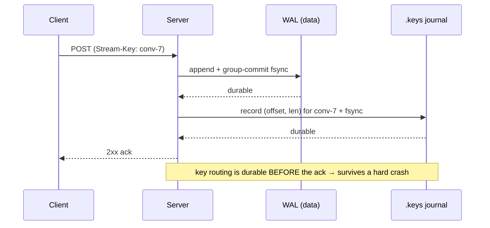
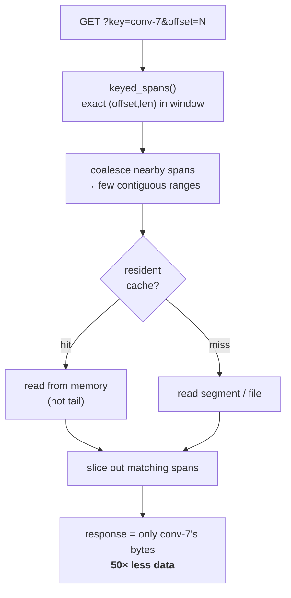

# durable-streams-keyed

> **Keyed-by-conversation reads for the kernel-speed Rust Durable Streams server.**
> Pull *one* conversation out of a multiplexed stream — fast, durable, and live —
> on the native `sendfile`/`splice` server that also does copy-on-write forks,
> without breaking the client you already run.

One stream per factory, `Stream-Key: <conversation>` on write, `?key=<conversation>`
on read. That's the [Prisma Bun server's](https://github.com/prisma/streams)
model — now on the [`durable-streams`](https://crates.io/crates/durable-streams)
Rust server, which had **no keyed reads at all** before this.

## Why

| Capability | This (Rust) | Prisma (Bun) |
|---|:---:|:---:|
| Native, zero-copy I/O | ✓ | ✗ |
| Fork / branching | ✓ | ✗ |
| Keyed-by-conversation reads | ✓ *(new)* | ✓ |
| Durable keyed index | ✓ *(new)* | ✓ |
| Live keyed reads | ✓ *(new)* | ✓ |

The Rust server was the fastest known Durable Streams implementation but couldn't
filter by key; Bun could filter but isn't native and can't fork. The bottom three
rows are what this project adds — so the Rust server can be the substrate and
*keep* its speed + fork advantage. Delivered as source patches over pristine
`durable-streams-0.1.2` (the crate is a binary with no public upstream repo to
depend on — see `docs/integration-points.md`).

## Benchmarks

> [!NOTE]
> Same-machine, relative numbers (a MacBook; `oha` and the server share cores
> over loopback, no cgroup pinning) — the crate's own `.bench-local.sh`
> methodology, for baseline-vs-change on one box. Reproduce: `bench/bench-keyed.sh`.

**Keyed read isolates one conversation** — one stream, 2000 appends round-robin
across K=50 keys, ~200 B each; medians of 3×5 s:

| scenario | rps | p50 | p99 | data returned |
|---|--:|--:|--:|--:|
| `?key=conv-7` (one conversation) | 16,237 | 3.2 ms | 14.6 ms | **8 KB** |
| full stream (client-side filter) | 24,356 | 2.6 ms | 3.4 ms | 400 KB |

Returns **50× less data** (8 KB vs 400 KB — exactly 1/K, proving correct
server-side filtering) at ~⅔ the throughput of reading everything. Filtering a
byte-log costs more CPU (it reads the coalesced superset and copies out the
wanted spans) — the win is wire-data reduction, decisive when the network, not
the CPU, is the bottleneck.

<details>
<summary><b>Why it got 10× faster, and base-server numbers</b></summary>

<br>

The keyed read went **1,644 → 16,237 rps** once it (a) read resident-cache-first
instead of per-span file reads and (b) coalesced a key's scattered spans into few
contiguous reads — porting Prisma's *serving pattern* ("one contiguous read,
filter in RAM"), **not** its probabilistic index.

Base server (unpatched, hot stream, `.bench-local.sh`): read1k 161,768 rps
(p50 0.39 ms), read1m 10,715 rps (p50 2.95 ms, `sendfile`), append 7,808 rps
(p50 8.1 ms, fsync-bound). Upstream kernel-speed ceiling on dedicated hardware:
~860k appends/s, ~2 GB/s reads, ~515 MB @ 100k streams.

</details>

### vs Bun, on the same machine

Prisma's Bun server (`prisma/streams` @ `b891877`, v0.1.11; Bun 1.3.9) run on
**this box with the same harness** (N=2000, K=50, ~200 B, c=64, 6 s × 3). Both do
keyed reads with **zero schema setup** (default profile) — no config divergence.

| scenario | This (Rust) | Bun | 
|---|--:|--:|
| **keyed read** `?key=` | **16,237 rps** · 3.2 ms p50 | 6,485 rps · 9.5 ms p50 |
| &nbsp;&nbsp;↳ CPU per request | ~1,180% total | **~100% total** |
| **full read** (uncapped) | **24,356 rps** · 2.6 ms | 1,135 rps · 54.5 ms |
| append (unkeyed) | ~7,808 rps | ~203 rps* |

**The honest read:**
- **Keyed read** — Rust is ~2.5× the throughput and ~3× lower latency, **but at
  ~4.5× the CPU per request.** Our speed comes from reading the coalesced
  *superset* across many cores; Bun's fingerprint index touches only the
  relevant blocks (~1 core). So *per core*, Bun's keyed read is leaner — the
  concrete case for wiring `crates/ds-index` when CPU-bound or at cold-segment
  scale. Rust wins wall-clock here; Bun wins CPU-efficiency.
- **Full read** — Rust ~21× (native zero-copy `sendfile` vs interpreted copy).
  This is the base-path gap, and it's large.
- **Append*** — Bun measured ~203 rps / ~330 ms p50, low enough that it looks
  like queueing under c=64 / local-mode ingest tuning rather than a clean
  throughput number; flagged, **not** root-caused — don't read it as a
  definitive multiple.
- Bun defaults to a 1000-record read cap (a stock `GET` returned half the
  stream); the full-read number above is with that cap raised, for parity.

Raw numbers + scripts in `bench/bun/`.

## What works

- **`Stream-Key` on append + `?key=` filtered reads** — isolate one conversation; composes with `?offset=`.
- **Fast** — coalesced spans + resident-cache-first serving: **~16k rps, 50× less data** than a full read.
- **Durable at ack** — a per-stream `.keys` journal fsyncs before the append is acked; rebuilt on restart. No crash-tail window.
- **Live** — keyed long-poll + SSE; a reader advances past other keys' data.
- **Real-client verified** — `@durable-streams/state` `createStreamDB` folds a `?key=` read into just that conversation's rows.
- **101 tests** (87 upstream + keying / persistence / live / journal), patch set verified to apply-clean + compile.

## How it works

**Writes are durable *before* the ack** — the routing key lives only in a request
header, so it's journaled and fsync'd alongside the data's own durability:



**Reads filter server-side, cheaply** — the exact per-append directory gives byte
ranges directly (no probabilistic index needed); scattered spans are coalesced
into few contiguous reads, served resident-cache-first, sliced in memory:



On restart, the `.keys` journal is replayed (torn-tail-safe, like the WAL) to
rebuild the in-memory directory — so keyed reads survive a crash unchanged.

## Honest caveats

- **Keyed-read CPU** is higher than a full read (filtering a byte-log reads the coalesced superset). Payoff is 50× less wire data.
- **Per-append fsync** on keyed writes (WAL + journal) buys durable-at-ack; batching into the WAL group commit would amortize it — a future perf optimization, not a correctness need.
- **Linux zero-copy guard** (`#[cfg(target_os = "linux")]`) is hand-reviewed but not compiled on macOS — needs a Linux/CI build.
- **`crates/ds-index`** (Prisma-style fuse-filter segment index) is tested but deliberately **not wired in** — the exact in-memory directory makes it unnecessary until a stream outgrows memory or spans thousands of cold segments. At that extreme, Bun's segment index likely beats the coalesce-and-filter approach until this is wired.

## Layout

```
patches/            generated diffs over pristine durable-streams-0.1.2 (the feature)
scripts/
  vendor-upstream.sh  fetch the real 0.1.2 source from crates.io
  verify-patches.sh   apply all patches to a fresh pristine tree + compile
crates/ds-index/    standalone Prisma-style segment index (tested, unwired)
bench/              bench-keyed.sh + results/ (keyed vs full-read)
client-verify/      real @durable-streams/state createStreamDB compat test
docs/               integration-points.md, write-path-design.md, plan.md
vendor/             (gitignored) upstream source lands here after vendoring
```

## Getting started

```bash
scripts/vendor-upstream.sh          # fetch pristine durable-streams 0.1.2
scripts/verify-patches.sh           # apply the feature patches + compile (verifies the set)
cargo test -p ds-index              # the standalone index crate

# run the patched server + benchmark
cd vendor/durable-streams-0.1.2 && CARGO_TARGET_DIR=/tmp/ds-bench-target cargo build --release
cd ../.. && bench/bench-keyed.sh demo
```

Read `docs/integration-points.md` before touching `vendor/`.

## License

Apache-2.0 (see `LICENSE`). `NOTICE` records provenance: patches over vendored
`durable-streams` source (Apache-2.0), and `ds-index` as an independent
reimplementation of Prisma streams' publicly documented index design (also
Apache-2.0) — no code copied from either project.
